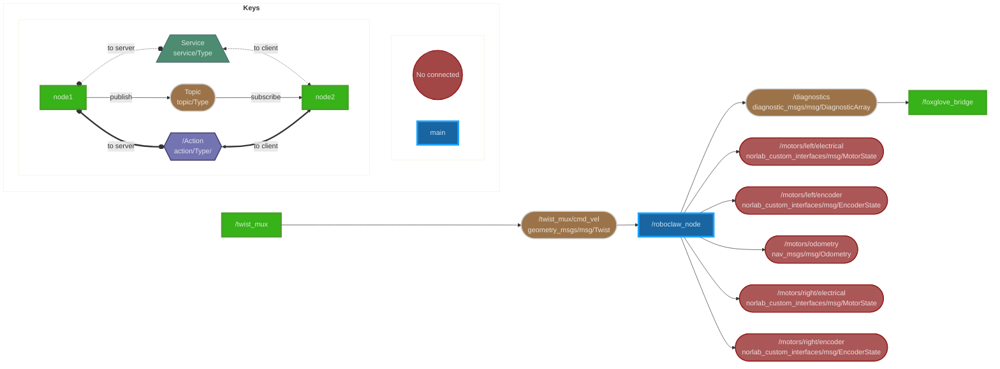

# RoboClaw ROS

> RoboClaw node for `melodic` & `humble`

[](https://opensource.org/licenses/BSD-3-Clause)
[](https://www.python.org)
[](http://wiki.ros.org/melodic)
[](https://docs.ros.org/en/humble)

Thanks to Brad Bazemore ([sonyccd](https://github.com/sonyccd)) for developing the original driver.

This is a ROS1/ROS2 driver for the RoboClaw motor controllers made by [Basicmicro Motion Control](https://www.basicmicro.com). It is actively maintained by the [Northern Robotics Laboratory](http://norlab.ulaval.ca/) of Université Laval.

## Dependencies

This ROS driver is using the python driver developed by [Team Chat Robotique](https://gitlab.com/team-chat-robotique/libraries/team-chat-robotique-roboclaw-python) (Thanks!). Install it with pip :

```sh
pip install tcr-roboclaw
```


## Before you begin

For the ROS1 (`melodic`) version : [melodic](https://github.com/norlab-ulaval/roboclaw_ros/tree/melodic)

Before you use this package, you need to calibrate the velocity PID on the RoboClaw. This will require to use BasicMicro's [Motion Studio](https://www.basicmicro.com/downloads) software (only available for Windows).

From the RoboClaw [user manual](https://downloads.basicmicro.com/docs/roboclaw_user_manual.pdf):

> Motion Studio provides the option to auto tune velocity and position control. To use the auto tune option, make sure the encoder and motor are running in the desired direction and the basic PWM control of the motor works as expected. It is recommend to ensure the motor and encoder
combination are functioning properly before using the auto tune feature.

> Go to the PWM Settings screen in Motion Studio.
> Slide the motor slider up to start moving the motor forward. Check the encoder is increasing in value. If it is not either reverse the motor wires or the encoder wires. The recheck.
> To start auto tune click the auto tune button for the motor channel that is will be tuned first. The auto tune function will try to determine the best settings for that motor channel.

## Usage instructions

Just clone the repo into your colcon workspace.  Remember to make sure ROS2 has permissions to use the dev port you give it.

```sh
cd <workspace>/src
git clone https://github.com/norlab-ulaval/roboclaw_ros.git
cd <workspace>
colcon build --symlink-install --packages-select roboclaw_ros
. install/local_setup.bash
ros2 launch roboclaw_ros roboclaw_node.launch.py
```

## Parameters

The launch file can be configured at the command line with arguments, by changing the value in the launch file or through the `ros2 param` server.

| Parameter            | Default        | Definition                                                             |
| -------------------- | -------------- | ---------------------------------------------------------------------- |
| `dev`                | `/dev/ttyACM0` | Path to the RoboClaw device path                                       |
| `baud`               | `115200`       | Baud rate the RoboClaw is configured for                               |
| `address`            | `128`          | The address the RoboClaw is set to, 128 is 0x80                        |
| `max_speed_linear`   | `2.0`          | Max linear speed allowed for motors in meters per second               |
| `max_speed_angular`  | `2.0`          | Max angular speed allowed for motors in meters per second              |
| `stop_if_idle`       | `true`         | Stops movement if no velocity commands are received for `idle_timeout` |
| `idle_timeout`       | `1.0`          | Duration, in seconds, after which motors are stopped when idle         |
| `ticks_per_meter`    | `4000`         | The number of encoder ticks per meter of movement                      |
| `ticks_per_rotation` | `2000`         | The number of encoder ticks per rotation of wheel                      |
| `base_width`         | `0.315`        | Width from one wheel center to another, in meters                      |
| `custom_pid`         | `true`         | Whether the driver should overwrite the PID parameters or not          |
| `p_constant`         | `3.0`          | Proportional gain of PID controller (unused if `custom_pid` is false)  |
| `i_constant`         | `0.42`         | Integral gain of PID controller (unused if `custom_pid` is false)      |
| `d_constant`         | `0.0`          | Derivative gain of PID controller (unused if `custom_pid` is false)    |
| `qpps`               | `6000`         | Maximum speed of motor, in ticks/sec (unused if `custom_pid` is false) |
| `odom_rate`          | `30`           | Rate of polling and publishing odometry data                           |
| `elec_rate`          | `10`           | Rate of polling and publishing electrical data                         |
| `publish_odom`       | `true`         | Publishes Odometry if set to true                                      |
| `publish_encoders`   | `true`         | Publishes EncoderState if set to true                                  |
| `publish_elec`       | `true`         | Publishes MotorState if set to true                                    |
| `publish_tf`         | `false`        | Broadcasts TF from `odom` to `base_link` if set to true                |

## Topics

### Subscribed

`/cmd_vel` [(geometry_msgs/Twist)](https://github.com/ros2/common_interfaces/blob/humble/geometry_msgs/msg/Twist.msg)
Velocity commands for the mobile base.

### Published

`/motors/odometry` [(nav_msgs/Odometry)](https://github.com/ros2/common_interfaces/blob/humble/nav_msgs/msg/Odometry.msg)
Odometry output from the mobile base.

`/motors/{left/right}/encoder` [(norlab_custom_interfaces/EncoderState)](https://github.com/norlab-ulaval/norlab_custom_interfaces/blob/main/msg/EncoderState.msg)
Encoder state for the left and right motors.

`/motors/{left/right}/electrical` [(norlab_custom_interfaces/MotorState)](https://github.com/norlab-ulaval/norlab_custom_interfaces/blob/main/msg/MotorState.msg)
Electrical data for both motors.

### RoboClaw Node graph



